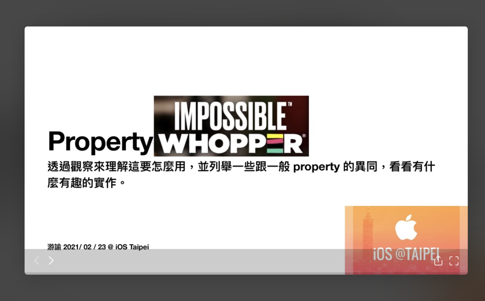

# 基於 Swift 5.4 PropertyWrapper 觀察

透過觀察來理解這要怎麼用，並列舉一些跟一般 property 的異同，看看有什麼有趣的實作。

[](https://speakerdeck.com/ytyubox/property-wrapper-in-swift)


## Table of content

1. 來看看 Swift.org 的教學
2. 來看看 @State
3. 來看看 @Published
4. 目前網路上看到的有趣實作 
5. 進階的 nested Property wrapper
6. 進階的 ThreadSafe

## 1. 來看看 Swift.org 的教學

From Swift.org [documentation of Properties](docs.swift.org/swift-book/LanguageGuide/Properties)

> A property wrapper adds a layer of separation between code that manages how a property is stored and the code that defines a property.
For example, if you have properties that provide thread-safety checks or store their underlying data in a database, you have to write that code on every property. 
When you use a property wrapper, you write the management code once when you define the wrapper, and then reuse that management code by applying it to multiple properties.

>> `manages how a property is stored` 可以解讀為一個物件內要如何去取得他的 property，`defines a property` 可以解讀成物件內要如何命名 property 與型別定義

```swift
// Swift
@propertywrapper struct TwelveOrLess {
    private var number: Int
    init() { self.number = 0 }

    var wrappedValue: Int {
        get { return number }
        set { number = min(newValue, 12) }
    }
}
```

在 Property wrapper 中最需要的是一個 Type 前綴 `@propertyWrapper` (大小寫注意），與一個 scope 相等的 property `wrappedValue`。有了這兩個，就可以宣告一個 Wrapper。

```swift
// Swift
struct SmallRectangle {
    @TwelveOrLess var height: Int
    @TwelveOrLess var width: Int
}
```

### 編譯器怎麼幫你的？

> When you apply a wrapper to a property, the compiler synthesizes code that provides storage for the wrapper and code that provides access to the property through the wrapper. (The property wrapper is responsible for storing the wrapped value, so there’s no synthesized code for that.) 
You could write code that uses the behavior of a property wrapper, without taking advantage of the special attribute syntax. [Swift.org](docs.swift.org/swift-book/LanguageGuide/Properties)
>> `Compiler synthesizes code` 可以與 Objective-C 的 `@synthesize` 解讀，基本上就是編譯器會自動補上程式碼。

```swift
// Swift
// Compiler 會自動幫你完成這段程式碼的撰寫，也就是說這個是上面的 SmallRectangle 在 Compiler 實際得到的資訊。
struct SmallRectangle {
    private var _height = TwelveOrLess()
    private var _width = TwelveOrLess()
    var height: Int {
        get { return _height.wrappedValue }
        set { _height.wrappedValue = newValue }
    }
    var width: Int {
        get { return _width.wrappedValue }
        set { _width.wrappedValue = newValue }
    }
}
```


### DI 建立初始值

```swift
// Swift
@propertyWrapper
struct SmallNumber {
    private var maximum: Int
    private var number: Int

    var wrappedValue: Int {
        get { return number }
        set { number = min(newValue, maximum) }
    }

    init() {    // 1
        maximum = 12
        number = 0
    }
    init(wrappedValue: Int) { // 2 
        maximum = 12
        number = min(wrappedValue, maximum)
    }
    init(wrappedValue: Int, maximum: Int) { // 3
        self.maximum = maximum
        number = min(wrappedValue, maximum)
    }
}
```

1. `init()` 沒有參數對應 `@SmallNumber var height: Int`
2. `init(wrappedValue:)` 對應 `@SmallNumber var width: Int = 1`
3. `init(wrappedValue:maximun)` 同時對應兩個：
```Swift
// Swift
@SmallNumber(wrappedValue: 3, maximum: 4) var width: Int
@SmallNumber(maximum: 9) var width: Int = 2
```

### Wrapper 提供額外的 `$VAR` ProjectedValue


```swift
// Swift
// 只要 Wrapper 有這個 projectedValue 存在，就可以使用 $var
var projectedValue: Bool
```
> 要注意的是 ·projectedValue 並不是來自於 `Protocol`，且 Swift 於 Foundation 並沒有相關的 `Protocol`

```swift
// Swift
struct SomeStructure {
    @SmallNumber var someNumber: Int
}

var someStructure = SomeStructure()

someStructure.someNumber = 4
```

### 在 Swift.org 沒看到的資訊

1. (get/set) 🙅‍♂️  
2. (willSet/didSet) 🙆‍♂️
3. KeyPath both works on wrappedValue / projectedValue
4. KVO OK, Wrapper 可以與 @objc dynamic 一起用
5. _var 是 private 宣告，$Project （目前）不可以用 extension // Nested 補充


## 2. 來看看 @State

> Federico 做了一個 FSState，實作請參考 https://fivestars.blog/swiftui/lets-build-state.html

關於實作一個 `@State` 有以下幾個問題：
1.  建立 一個 Propertywrapper，要用 Struct 還是 class，或是其他？
2. 在 SwiftUI，ContentView 是 struct，會有 mutate 的語法問題
3  在 wrapper mutate 之後，要如何讓 SwiftUI 響應變化
4. 如何透過 `$text` 來傳遞一個  `Binding`


## 3. 來看看 @Published

在 Combine 的 Published 的實驗中，可以嘗試在 struct 內宣告一個 `@Published`

```swift
// Swift

struct WrapperOwner {
    @Published var i = 0 // expected-error {{'wrappedValue' is unavailable: @Published is only available on properties of classes'}}    
} 
```

這個要如何實作出來了，我們可以看看 Property wrapper 當初的 Swift evolution [SE-0258](https://github.com/apple/swift-evolution/blob/master/proposals/0258-property-wrappers.md)，中的一段

> Instead of a wrappedValue property, a property wrapper type could provide a static subscript(instanceSelf:wrapped:storage:)that receives self as a parameter, along with key paths referencing the original wrapped property and the backing storage property.
>>  Swift 選擇在 Object Owner 時透過 static subscript 來處理，也就是說 compiler 在這個時候實作的方式會變的不一樣。

```swift
// Swift
public class MyClass: Superclass {
  @Observable public var myVar: Int = 17
  
  // desugars to...
  private var _myVar: Observable<Int> = Observable(wrappedValue: 17)
  public var myVar: Int {
    get { Observable<Int>[instanceSelf: self, wrapped: \MyClass.myVar, storage: \MyClass._myVar] }
    set { Observable<Int>[instanceSelf: self, wrapped: \MyClass.myVar, storage: \MyClass._myVar] = newValue }
  }
}
```

## 4. 目前網路上看到的有趣實作 
1. DebugOverrideable https://www.swiftbysundell.com/tips/making-properties-overridable-only-in-debug-builds/
2. LoggingExcluded https://olegdreyman.medium.com/keep-private-information-out-of-your-logs-with-swift-bbd2fbcd9a40
3. SecureAppStorage https://gist.github.com/pauljohanneskraft/4652fbeae67a2206ad6b4296675e9bb5 
4. BetterCodable https://github.com/marksands/BetterCodable 
5. Fluent-kit https://github.com/vapor/fluent-kit
6. Proxy https://www.swiftbysundell.com/articles/accessing-a-swift-property-wrappers-enclosing-instance/ 

## 5. 進階的 nested Property wrapper

由於一些 Wrapper 並沒有實際上對 Owner 的影響，例如由 olegdreyman 實作的 `LoggingExcluded`，這樣的事情可以與其他 Wrapper 一起交疊存在。

```swift
// Swift
struct Nested {
    @State
    @LoggingExcluded
    var nest1 = 0
    
    @LoggingExcluded
    @State
    var nest2 = 0
}
```

然而當我們要使用 `Nest().$nest1` 與 `Nest().$nest2` 相對應有一定的問題。
而處理這個問題可以使用 Protocol 來處理。

```swift
// Swift
public protocol Projected {
    associatedtype ProjectedValue
    var projectedValue: ProjectedValue { get }
}
```

當要使用這個 `Projected` 的時候，我第一個想到的是使用 `where` 的方式。
```swift
// Swift
extension LoggingExcluded: Projected
where Value: Projected {
    public typealias ProjectedValue = Value.ProjectedValue
    public var projectedValue: Value.ProjectedValue {
        wrappedValue.projectedValue
    }
}
```

> 然而目前並不能讓 compiler 知道 `LoggingExcluded` 在什麼時候有 projectedValue。這個情況可能會在 Swift 5.4 之後改變，也可能不會。

我們可以做的，是使用另一個 wrapper

```swift
// Swift
@propertyWrapper 
public struct LoggingExcluding<Value: Projected>{
    ...
    
    public var projectedValue: Value.ProjectedValue {
            wrappedValue.projectedValue
    }
}
```

> 透過兩個非常相似的名字，後續要修改也相當方便。

## 6. 進階的 ThreadSafe

```swift
// Swift

@propertyWrapper struct Lock<Value> {
    private var inner: LockInner

    init(wrappedValue: Value) {
        inner = LockInner(wrappedValue)
    }

    var wrappedValue: Value {
        get { return inner.value }
        nonmutating _modify {
            inner.lock.lock()
            defer { inner.lock.unlock() }
            yield &inner.value
        }
    }

    private class LockInner {
        let lock = NSLock()
        var value: Value

        init(_ value: Value) {
            self.value = value
        }
    }
}
```

> 這個目前我透過測試驗證了是有效的實作，請看 `PropertywrapperTests/ThreadSafe/Lock.swift`


## 其他沒有提到的部分
1. apple/swift 的編譯器討論 （C++）
2. Owner 繼承、lazy、weak、unowned 的問題 
3. Swift 5.4 的 Local Property wrapper
4. apple/swift 的編寫案例 （很多沒有討論到的）https://github.com/apple/swift/blob/main/test/decl/var/property_wrappers.swift
5. SwiftUI 已經有的 Property wrapper https://www.hackingwithswift.com/quick-start/swiftui/all-swiftui-property-wrappers-explained-and-compared


## 結論 Property wrapper

將會在社群的 talk 上，與其他開發者交流了這些問題。
1. Propertywrapper 帶給Developer有什麼不同？
2. Property wrapper 有沒有 Anti-Pattern？
3. Property wrapper 有沒有必要使用？
